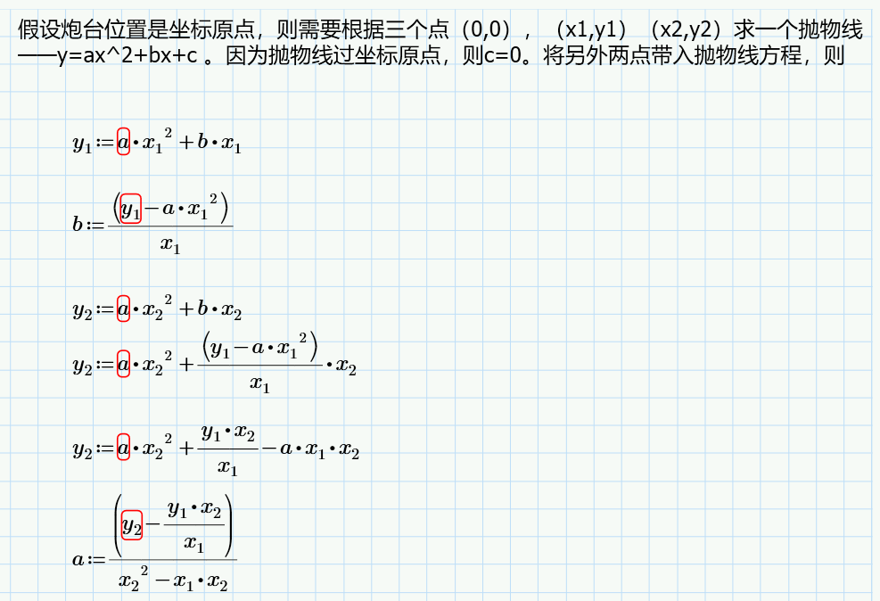
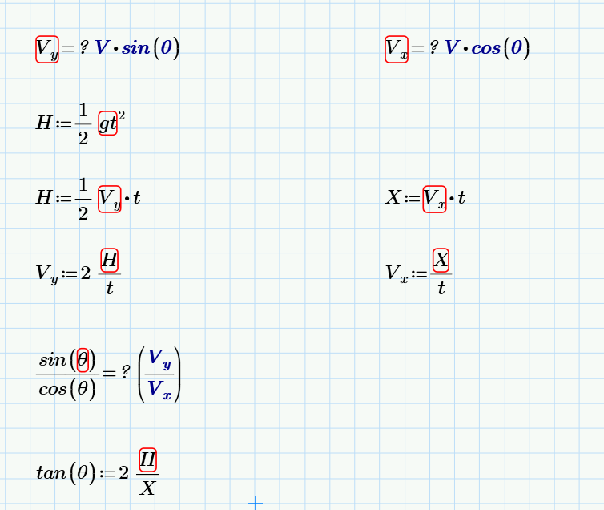
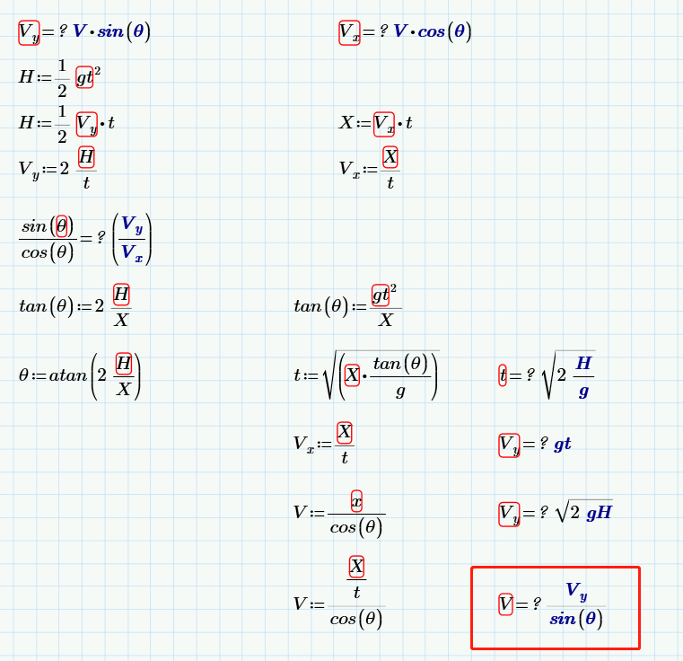
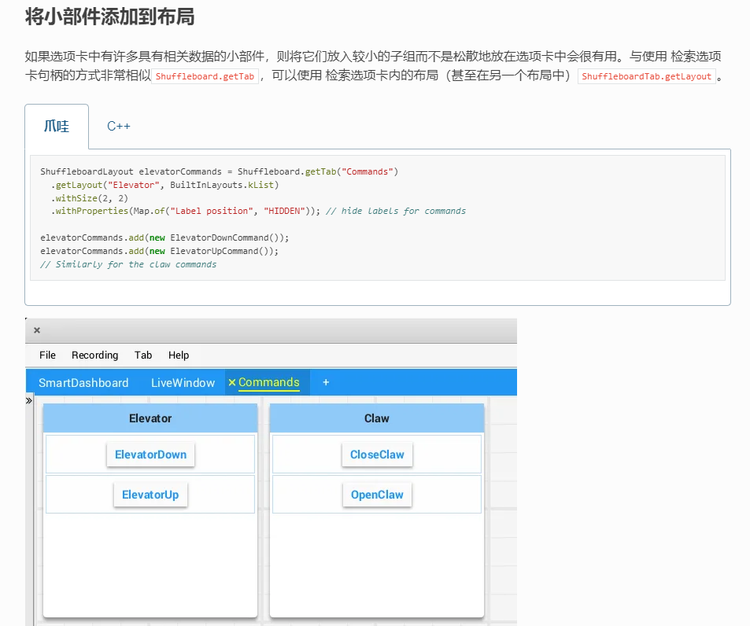

# FRC2022CommandBaseCode
自己编写的使用CommandBase模式控制的5737 FRC2022板版车的程序
# 2023.7.14 周五 可寻址LED灯+自动程序
## 可寻址LED灯
学习地址：https://docs.wpilib.org/en/stable/docs/software/hardware-apis/misc/addressable-leds.html  
在robot.java中写的

```java
/*********************ADDRESS ABLE LED************************** */
  private AddressableLED m_led = new AddressableLED(SensorConstant.Addressable_LED);
  private AddressableLEDBuffer m_ledBuffer= new AddressableLEDBuffer(SensorConstant.Addressable_LED_Number);
  private double m_rainbowFirstPixelHue=0;
/***************************************************
   * ADDRESSABLE LED RAINBOW 
******************************************************/
  private void rainbow() {
    for (var i = 0; i < m_ledBuffer.getLength(); i++) {
      final var hue = (m_rainbowFirstPixelHue + (i * 180 / m_ledBuffer.getLength())) % 180;
      m_ledBuffer.setHSV(i, (int)hue, 255, 128);
    }
    m_rainbowFirstPixelHue += 3;
    m_rainbowFirstPixelHue %= 180;
  }
  @Override
  public void robotInit() {
    /*********************ADDRESS ABLE LED************************** */
    m_led.setLength(m_ledBuffer.getLength());
    m_led.setData(m_ledBuffer);
    m_led.start();
  //   for (var i = 0; i < m_ledBuffer.getLength(); i++) {
  //     m_ledBuffer.setRGB(i, 255, 0, 0);
  //  }
  rainbow();
  m_led.setData(m_ledBuffer);
  }
```
## 自动程序：自动程序只需要执行一遍。
学习地址：https://docs.wpilib.org/en/stable/docs/software/dashboards/smartdashboard/choosing-an-autonomous-program-from-smartdashboard.html#running-autonomous-code  
``` java
//TIMED ROBOT 程序
 /*********************AUTO SELECT************************** */
  private final SendableChooser<String> m_chooser = new SendableChooser<>();
  private static final String kDefaultAuto = "Default";
  private static final String kCustomAuto = "My Auto";
  private String m_autoSelected;

   @Override
  public void robotInit() {
    m_robotContainer = new RobotContainer();
    
    /*********************AUTO SELECT************************** */
    m_chooser.setDefaultOption("Default Auto", kDefaultAuto);
    m_chooser.addOption("My Auto", kCustomAuto);
    SmartDashboard.putData("Auto choices", m_chooser);
  }
  @Override
  public void autonomousInit() {
    m_autoSelected = m_chooser.getSelected();
    m_autoSelected = SmartDashboard.getString("Auto Selector", kDefaultAuto);
    System.out.println("Auto selected: " + m_autoSelected);
  }

  @Override
  public void autonomousPeriodic() {
    switch (m_autoSelected) {
      case kCustomAuto:
        // Put custom auto code here
        break;
      case kDefaultAuto:
      default:
        // Put default auto code here
        break;
    }
  }
```
# 2023.7.13 周四 抛物线计算





```java
 public double calculate_velocity(double distance) {
    double ang = 0;
    double x1 = distance;
    double y1 = PhotonVisionConstant.Camera_height - PhotonVisionConstant.Target_height;
    double x2 = distance - 0.2;
    double y2 = y1 + 0.1;
    double parabola_a = ((y1 * x2 / x1) - y2) / ((x1 * x2) - (x2 * x2));
    double parabola_b = (y1 - (x1 * x1 * parabola_a)) / x1;

    double vertex_x = -parabola_b / (2 * parabola_a);
    double vertex_y = (-parabola_b * parabola_b) / (4 * parabola_a);
    ang = (Math.atan((2 * vertex_y) / vertex_x)) * 180 / 3.14;

    double x = (vertex_x) * 2;
    double fenzi = x * x * 9.8;
    double fenmu = Math.sin(3.14 / 180 * 2 * ang) * Math.cos(3.14 / 180 * ang);

    double velocity = Math.pow((fenzi / fenmu), (1.0 / 3.0)) * 3 - 0.15;
    return velocity;
  }
```
暂时还未弄清楚速度是怎么计算的


# 2023.7.10 周一 抛物线计算

$ V_x = V*cosθ $

$ V_y = V*sinθ = gt $

$ X_2 = V_xt $

$ Y_2 = {1\over2} gt^2 $


# 2023.7.5 周三 ShuffleBoard学习
今天更新了Shooter里的shuffle功能。

```java

Shuffleboard.getTab("Numbers").add("Pi", 3.14);
//更新数据有两种方法，一种是在periodic里面直接使用add方法更新。
//这种方法不知道为什么总是报错，导致机器人断联。
//还有一种方法是使用网络表的形式，如下
```

``` java
//创建标签页
ShuffleboardTab ShooterTab = Shuffleboard.getTab("ShooterTab");
//获取标签页,返回标签页对象.这个语句不知道为什么也总报错
//Shooterlayout = Shuffleboard.selectTab("ShooterTab")

//创建Layout
ShuffleboardLayout Shooterlayout = ShooterTab
  .getLayout("Shooter", BuiltInLayouts.kGrid);
  .withSize(2, 2)
  .withProperties(Map.of("Label position", "HIDDEN")); // hide labels for commands;


public NetworkTableEntry ShooterSpeed = ShooterTab
      .add("Shooter Speed", 0)                          //添加想要显示的部件，初始化部件名称和初始值
      .withWidget(BuiltInWidgets.kGraph)                //设置显示模式为Graph(折线图)
      .withProperties(Map.of("min", 0, "max", 10000))   //配置最大值和最小值
      .withSize(3,3)                                    //配置组件大小
      .withPosition(0, 0)                               //组件位置
      .getEntry();                                      //配置为可更新的


public ShooterSubsystem() {

}

public void periodic(){
      ShooterSpeed.setDouble(RawSensorUnittoRPM(m_shooter_left_falcon.getSelectedSensorVelocity()));
   //更新网络表内容
}
 ```

 这里没太看懂：
 https://docs.wpilib.org/en/stable/docs/software/dashboards/shuffleboard/layouts-with-code/organizing-widgets.html

